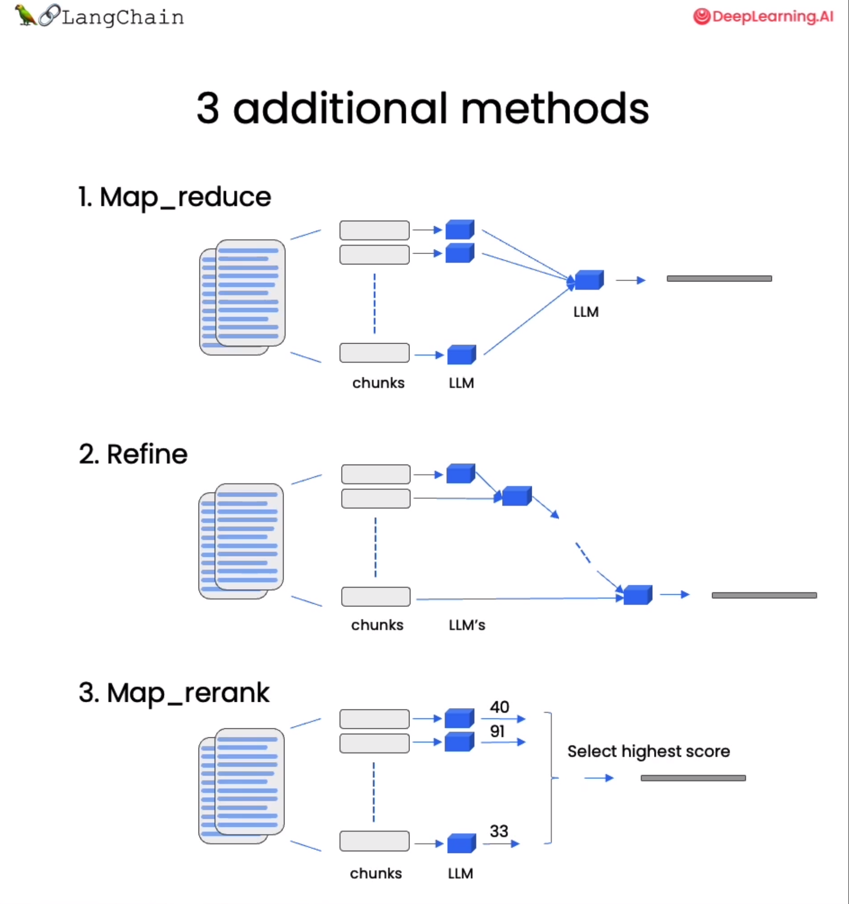

# Tucson .NET User Group - How to leverage AI to Chat with your own data

## Introduction

LLMs are a powerful tool for answering questions about documents, but they are limited to the information they were trained on. To use an LLM to answer questions about documents it was not trained on, additional information about those documents is required. The most common approach to providing this additional information is through "retrieval augmented generation".

The idea of retrieval augmented generation is that when given a question you first do a retrieval step to fetch any relevant documents. You then pass those documents, along with the original question, to the language model and have it generate a response. In order to do this, however, you first have to have your documents in a format where they can be queried in such a manner.

- [ref learn.deeplearning.ai](https://learn.deeplearning.ai/langchain-chat-with-your-data)

### What we are trying to accomplish and why?

There are many use cases for leveraging AI to chat with your own data.

1. **Document summarization:** AI can be used to summarize lengthy documents, making it easier to understand the key points without having to read through the entire document.

2. **Document classification:** AI can be used to classify documents based on their content, making it easier to organize and search through large amounts of data.

3. **Question answering:** AI can be used to answer questions about a document, making it easier to find specific information without having to manually search through the document.

4. **Sentiment analysis:** AI can be used to analyze the sentiment of a document, making it easier to understand the overall tone and mood of the content.

5. **Content generation:** AI can be used to generate new content based on existing documents, making it easier to create new content without having to start from scratch.

6. **Personal tutoring system:** AI can be used to provide personalized tutoring and educational resources to individuals based on their learning needs and preferences.

7. **Personal pair programming assistant:** AI can be used to assist developers in pair programming by suggesting code changes and providing real-time feedback.

8. **Personal research assistant:** AI can be used to assist individuals in conducting research by providing relevant information and sources.

Let's consider a personal research assistant.

- 

- [reference - gpt-researcher](https://github.com/assafelovic/gpt-researcher)

## Fine Tuning and Embeddings are two primary ways to get an LLM to take your data and interact with it

### Fine-Tuning

#### Pros:
- **Customization**: Allows for a high degree of customization to tailor the model to your specific dataset.
- **Accuracy**: Can potentially yield more accurate results as the model is trained on your specific data.
- **Control**: Gives you more control over the model's behavior and output.

#### Cons:
- **Resource-Intensive**: Requires substantial computational resources and expertise in machine learning.
- **Data Requirement**: Requires a large and well-annotated dataset for effective fine-tuning.
- **Maintenance**: Requires ongoing maintenance and updates to ensure the model remains effective over time.

### Embeddings

#### Pros:
- **Simplicity**: Generally simpler to implement compared to fine-tuning, especially if you are using pre-trained embeddings.
- **Flexibility**: Allows for the integration of various types of data (text, image, etc.) into a unified vector space.
- **Resource-Efficient**: Less computationally intensive compared to fine-tuning.

#### Cons:
- **Limited Customization**: Offers a lower degree of customization compared to fine-tuning.
- **Potential Inaccuracy**: May not capture the nuances of your specific content as effectively as a fine-tuned model.
- **Dependent on Pre-Trained Models**: The quality of the embeddings is largely dependent on the quality of the pre-trained models used to generate them.

### Conclusion

- **Fine-Tuning**: Choose this approach if you have the necessary resources and a large dataset. It is suitable for projects requiring high accuracy and customization.
- **Embeddings**: Opt for this method if you are looking for a simpler, more resource-efficient solution. It is ideal for projects with limited resources or those looking to quickly implement a solution without delving deep into machine learning.

## Can other types of data be used as the source?

Embeddings can be used with various types of data, including text, images, and audio. In natural language processing, word embeddings are commonly used to represent words as vectors in a high-dimensional space. Image embeddings can be used to represent images as vectors, while audio embeddings can be used to represent audio signals as vectors.

<!-- - -->

- 

#### **Conclusion**
- Utilizing documents, URLs, search results, and other information with LLMs for question-answering significantly broadens the scope and utility of the LLM. It becomes a versatile tool capable of handling a wide range of queries in various fields, leveraging a rich and diverse knowledge base for more informed and comprehensive responses.

## ways to chat with documents and data using LLMs

Quick look at some examples

- chatgpt plugins
- semantic kernel copilot sample application
- https://github.com/assafelovic/gpt-researcher
- google for "chat with pdf" to see lots of options
- write your own

## Two frameworks that can help build Large Language Model (LLM) applications

- [Microsoft Semantic Kernel](https://learn.microsoft.com/en-us/semantic-kernel/overview/)
- [Langchain](https://www.langchain.com/)

- [Microsoft Semantic Kernel Github](https://github.com/microsoft/semantic-kernel)
- [Langchain Github](https://github.com/langchain-ai/langchain)

## RAG - Retrieval Augmented Generation involves these steps

- Document Loading
- Document Splitting
- Vector stores and Embeddings
- Retrieval
- Question Answering
- Chat

- Document Loaders - see image above
- Document Splitting
- Embeddings - [see animations here](https://openai.com/blog/introducing-text-and-code-embeddings))
- Vector Stores
- Retrieval -  
- Question Answering
- Chat - we'll look at The following for semantic kernel 

- [good example of bringing it all together with langchain](https://learn.deeplearning.ai/langchain-chat-with-your-data/lesson/7/chat)

## References

- [DeepLearning.ai short courses](https://www.deeplearning.ai/short-courses/)
- [Semantic Kernel Memories](https://learn.microsoft.com/en-us/semantic-kernel/memories/)
- [Semantic Kernel Memories Context (C# Tab)](https://learn.microsoft.com/en-us/semantic-kernel/memories/context?tabs=Csharp)
- [Semantic Kernel Memories Embeddings](https://learn.microsoft.com/en-us/semantic-kernel/memories/embeddings)
- [Semantic Kernel Memories Vector Database](https://learn.microsoft.com/en-us/semantic-kernel/memories/vector-db)
- [AI Course langchain chat with your data](https://learn.deeplearning.ai/langchain-chat-with-your-data)
